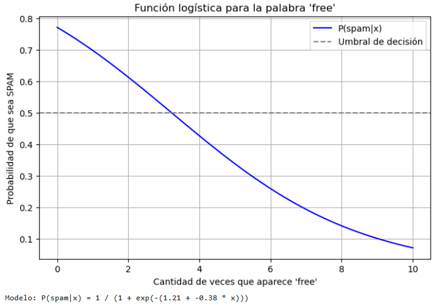

## Laboratorio 06 : Regresión Logistica

Paso 01: Ingresamos al siguiente enlace [link](source/lab06-reg_logistica.ipynb),y lo vamos ingresando en jupiter notebook.

Paso 02: Descargar archivos de datos del laboratorio en el siguiente enlace [link](https://drive.google.com/file/d/1jyW5leoYk_BwL3k7vc-JCl1Ns0QBnyp7/view?usp=drive_link)

