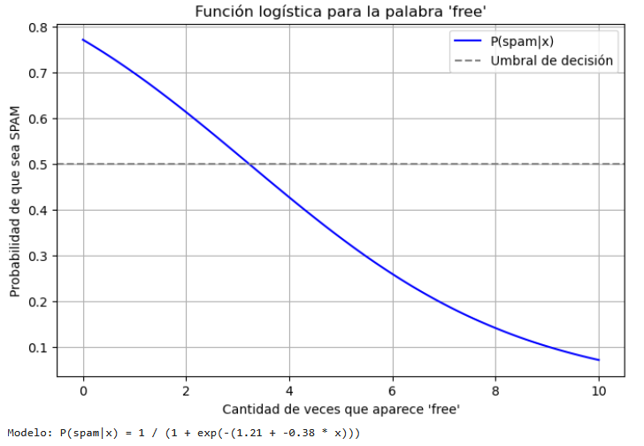

## Laboratorio 01 : Introducción a Numpy

Paso 01: Ingresamos al siguiente enlace [link](source/lab01-numpy.ipynb),y lo vamos ingresando en jupiter notebook.

Paso 02: La explicación para el uso de esta libreria se encuentran en el siguiente video.

https://www.youtube.com/watch?v=cYm3DBG6KfI

El detalle de temas a tratar se muestran a continuación:

- Creación de arrays
- Modificar tipos de datos
- Funciones generadoras de arrays simples (zero, ones, Empty)
- Funciones generadoras de arrays avanazadas (arange,linspace)
- Números aleatorios
- Filtrar Datos
- Selección de datos en el array

## Laboratorio 02 : Introducción a Panda

Paso 01: Descargar el siguiente archivo , [CVS](data/dataset.csv) y procedemos a guardarlo en nuestra carpeta de usuario de la computadora local que tenemos. (p.e C:\Users\rodrigo)

Paso 02: Abrimos el siguiente enlace, [link](source/lab02-pandas.ipynb), y lo vamos ingresando en jupiter notebook.

Paso 03: La explicación para el uso de esta libreria se encuentran en el siguiente video.

https://www.youtube.com/watch?v=8ASjvOIyyl8

El detalle de temas a tratar se muestran a continuación:

- Creación de arrays
- Modificar tipos de datos
- Funciones generadoras de arrays simples (zero, ones, Empty)
- Funciones generadoras de arrays avanazadas (arange,linspace)
- Números aleatorios
- Filtrar Datos
- Selección de datos en el array

## Laboratorio 03 : Introducción a matplotlib

Paso 01: Elaboración detalla de un grafico de lineas

https://www.youtube.com/watch?v=eDO6s5GWQx4&list=PLPVRz5_vdd2l8YT17MYVC_uN7c4OgJLSE&index=3

Paso 01: La explicación para el uso de esta libreria se encuentran en el siguiente video.

https://www.youtube.com/watch?v=QPaHUBphDgo

El detalle de temas a tratar se muestran a continuación:

- Lineplots (Gráfico Lineal)
- Barplots (Gráfico de Barras)
- Piecharts
- Histogramas
- Boxplots
- Scatterplot ((Diagrama de dispersión))
- Sublplot

## Laboratorio 04 : Regresión Linea

Paso 01: Ingresamos al siguiente enlace [link](source/lab04-reg_lineal.ipynb),y lo vamos ingresando en jupiter notebook.

El detalle de temas a tratar se muestran a continuación:

- Generación de datos
- Visualización de conjunto de datos
- Modificación de conjunto de datos
- Construcción de modelo
- Predicción de nuevos ejemplos

Paso 02: Realizar el laboratorio y obtener el costo para un incidente que afecta a 1300 computadoras.

## Laboratorio 05 : Datos

Paso 01: Ingresamos al siguiente enlace [link](source/lab05-datos.ipynb),y lo vamos ingresando en jupiter notebook.

Paso 02: Descargar archivos de datos del laboratorio en el siguiente enlace [link](data/KDDTrain+.txt) y [link](data/KDDTrain+.arff)

## Laboratorio 06 : Regresión Logistica

Paso 01: Ingresamos al siguiente enlace [link](source/lab06-reg_logistica.ipynb),y lo vamos ingresando en jupiter notebook.

Paso 02: Descargar archivos de datos del laboratorio en el siguiente enlace [link](https://drive.google.com/file/d/1jyW5leoYk_BwL3k7vc-JCl1Ns0QBnyp7/view?usp=drive_link)

## Laboratorio 07 : Selección de características 

Paso 01: Descargar archivos de datos del laboratorio en el siguiente enlace [link](https://drive.google.com/file/d/1jyW5leoYk_BwL3k7vc-JCl1Ns0QBnyp7/view?usp=drive_link)

Paso 02: Ingresamos al siguiente enlace para realiza la reducción de caracteristicas con el metodo PCA [link](source/lab07-reg_logistica02.ipynb),y lo vamos ingresando en jupiter notebook.

Paso 03: Ingresamos al siguiente enlace para revisar la selección de caracteristicas con el metodo de Random Forest [link](source/lab08-Random-Forest.ipynb),y lo vamos ingresando en jupiter notebook.

## Laboratorio 09 : Redes Neuronales Artificiales 

Paso 01: Descargar archivos de datos del laboratorio en el siguiente enlace [link](data/lab_09.zip)

Paso 02: Ingresamos al siguiente enlace  [link](source/lab09_Clasificacion_naranjas.ipynb),y lo vamos ingresando en jupiter notebook.

## Laboratorio 10 : RNA - Perceptrón 

Paso 01: Ingresamos al siguiente enlace  [link](source/lab10_Perceptron.ipynb),y lo vamos ingresando en jupiter notebook.

## Laboratorio 11 : RNA - Reconocimiento de Imagenes Perceptrón 

Paso 01: Ingresamos al siguiente enlace  [link](source/lab11_Reconocimiento_Imagen_Perceptron.ipynb),y lo vamos ingresando en jupiter notebook.

