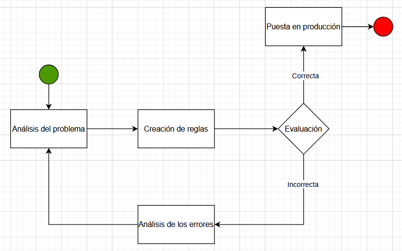
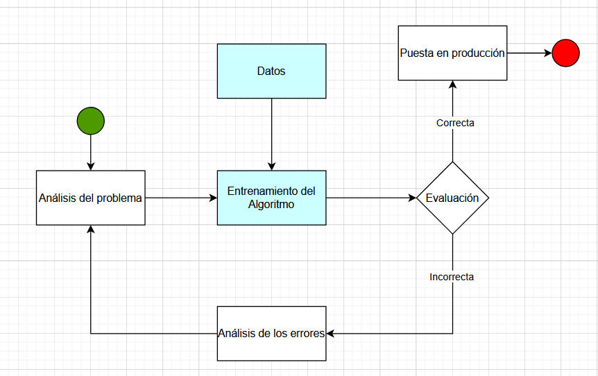
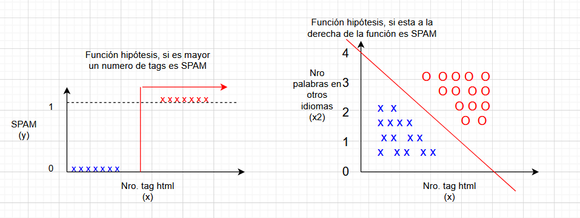

# Introducción al Aprendizaje Automático (Machine Learning)

¿Por qué queremos que una máquina aprenda? ¿Por qué no programarla directamente con la solución? Hay dos razones principales:

- Los desarrolladores no pueden anticipar todas las situaciones futuras. Por ejemplo, un robot que navega laberintos debe aprender el diseño de cada nuevo laberinto.

- A veces los desarrolladores no saben cómo programar la solución. Por ejemplo, las personas reconocen caras de familiares de manera subconsciente, pero es difícil programar esa habilidad sin usar algoritmos de aprendizaje automático.

__¿Que es el Machine Learning?__
"El apredizaje automático es un subdominio de la Inteligencia Artificial que proporciona a los sistemas la capacidad de aprender y mejorar automáticamente a partir de la experiencia __sin ser programados explícitamente.__ Se basa en la hipótesis subyacente de __crear un modelo__ y tratar de __mejorarlo ajustando más datos en el modelo__ a lo largo del tiempo"
-Arthur Samuel 

Ejemplo:
Se plantea la construcción de un filtro capaz de identificar y bloquar correos de SPAM.

Un analista deberá definirá un motor reglas para extraer los correos spam. Pero con el paso del tiempo se pueden ir desactualizando las reglas.

Un analista va a componer un conjunto de datos que son SPAM y define un algoritmo de machine learning y procede a entrenarlo, es proceso se denomina definición del modelo capaz de realizar predicciones. 

__¿Cuándo utilizar Machine Learning?__
- En soluciones que funcionan mediante la aplicación de un conjunto extenso de reglas o heurísticas
- En problemas complejos en los que un analistas no es capaz de determinar una solución a partir de la información existente
- En entornos que fluctúan o varian con frecuencia
- Apoyo de la fase de análisis en enfoques tradicionales en los que se dispone de conjuntos de datos muy grandes y dificiles de interpretar

__Aplicaciones del Aprendizaje Automático__

El aprendizaje automático es una parte esencial del desarrollo de software. Ejemplos incluyen:
- Aceleración del análisis de imágenes astronómicas en un factor de 10 millones.
- Reducción del consumo energético en centros de datos en un 40%.
- Mejora de arquitecturas de computación según Google AI.

## Tipos de los sistemas de Machine Learning

https://www.youtube.com/watch?v=oT3arRRB2Cw

__Formas de Aprendizaje__

- __Aprendizaje supervisado__: El agente aprende a partir de ejemplos etiquetados (ej. reconocer peatones en imágenes).
- __Aprendizaje no supervisado__: Encuentra patrones sin etiquetas explícitas (ej. agrupar imágenes similares).
- __Aprendizaje por refuerzo__: Aprende de recompensas y castigos (ej. mejorar su estrategia en ajedrez).

__Inducción vs. Deducción__
La inducción generaliza a partir de datos (ej. "el sol siempre ha salido, lo hará mañana"), pero no garantiza certeza, a diferencia de la deducción lógica.

 Un ejemplo de deducción es el silogismo. Por ejemplo, "Todos los hombres son mortales (premisa mayor); Sócrates es hombre (premisa menor); luego, Sócrates es mortal (conclusión)". 

__Modelos de Aprendizaje__
El aprendizaje puede manejar datos representados como vectores de atributos (factored), estructuras atómicas o modelos relacionales. Según la naturaleza de la salida, el problema puede clasificarse como:

- Clasificación: Predicción de valores discretos (ej. spam/no spam).

- Regresión: Predicción de valores numéricos (ej. temperatura del día siguiente).

Este capítulo sienta las bases para entender cómo los agentes pueden aprender y mejorar su rendimiento a partir de la experiencia.

## Laboratorio 02:

Revisar el ejercicio que se encuentra en el siguiente [enlace](/00_Laboratorio/Laboratorio02.md)

