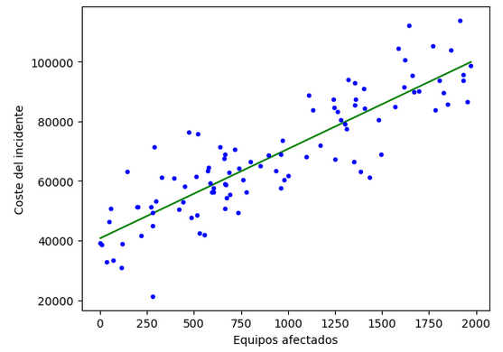

## Regresion Lineal

__Conjunto de datos de entrenamiento__

|Número sistema afectado (x)  | Coste en euros (y) |
|-----------------------------|--------------------|
|1000                         | 10,000             |
|1500                         | 20,000             |
|500                          | 5,500              |
|...                          |...                 |

donde:
x = variables de entrada
y = variables de salida
(x,y) = ejemplo de entrenamiento

__Función de hipótesis__

h_{\theta}

