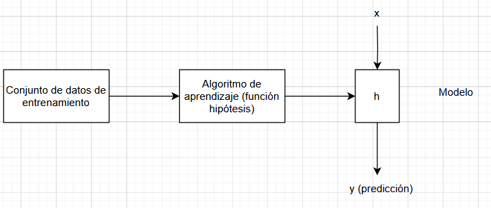
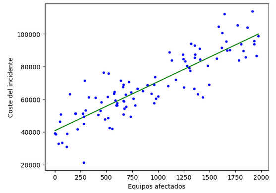

## Aprendizaje Supervisado - Regresion Lineal

<p align="center">

</p>

### Conjunto de datos de entrenamiento

|Número sistema afectado (x)  | Coste en euros (y) |
|-----------------------------|--------------------|
|1000                         | 10,000             |
|1500                         | 20,000             |
|500                          | 5,500              |
|...                          |...                 |

donde:
-  x = variables de entrada
-  y = variables de salida
-  (x,y) = ejemplo de entrenamiento

### Función de hipótesis

$$h_{\theta}(x)=\theta_{0}+\theta_{1}x$$


<p align="center">

</p>

La función hipotesis de la regresión lineal, está representada por una función generica que podria ser una linea recta en el caso de que solo se considere una caracteristica en el modelo.

(*) Si en el conjunto de datos se considerar varias caracteristicas para la evaluación del modelo, función hipotesis sería una regresión lineal multivariable la cual se representa de la siguiente manera:

$$h_{\theta}(x)=\theta_{0}+\theta_{1}x_{1}+\theta_{2}x_{2}+...+\theta_{n}x_{n}$$

__Como medimos el error?__

La diferencia entre el valor real y el valor predicho es:
errorᵢ = yᵢ - ŷᵢ = yᵢ - (m * xᵢ + b)

Este error puede ser positivo o negativo. Si solo los sumamos, podrían cancelarse.

Para evitar que los errores se cancelen entre sí y penalizar más los errores grandes, usamos el error cuadrático:
(yᵢ - (m * xᵢ + b))²

Ahora sumamos todos esos errores para todos los puntos del conjunto de entrenamiento:
Σ (yᵢ - (m * xᵢ + b))²

Y finalmente, como hay n muestras, sacamos el promedio:
ECM(m, b) = (1/n) * Σ [yᵢ - (m * xᵢ + b)]²

__Parámetros de la función__

Los parámetros de la función $$\theta_{0}$$ y $$\theta_{1}$$ , determinan la función matematica. El objetivo es encontrar el valor optimo de esos parámetros que ajusten mejor a la tendencia de nuestros conjuntos de datos.

¿Cómo se minimiza?
Usamos cálculo diferencial para minimizarla. Para encontrar los valores óptimos de m y b, derivamos el ECM respecto a m y b, y los igualamos a cero:

1. Derivamos el ECM respecto a m y b:
Derivada respecto a m:

∂ECM/∂m = (-2/n) * Σ xᵢ * [yᵢ - (m * xᵢ + b)]

Derivada respecto a b:

∂ECM/∂b = (-2/n) * Σ [yᵢ - (m * xᵢ + b)]

Derivando la función ECM con respecto a 𝑚 y 𝑏, y resolviendo el sistema de ecuaciones que se genera (igualando las derivadas parciales a cero).
Pero vamos paso a paso con el resultado final ya derivado:

Fórmulas:

$$m=\frac{\sum_{i=1}^{n}(x_i-\bar{x})(y_i-\bar{y})}{\sum_{i=1}^{n}(x_i-\bar{x})^2}$$

$$b=\bar{y}-\bar{x}*m$$

Donde:

$$\bar{x}$$ : es el promedio de los valores de entrada 

$$\bar{y}$$ : es el promedio de los valores de salida 

https://www.youtube.com/watch?v=hmVh2ddVCK4


### Construcción del modelo

Para obtener la función en un regresion lineal utilizamos los siguientes comandos:

from sklearn.linear_model import LinearRegression

__Construcción del modelo y ajuste de la función hipótesis__
```
lin_reg = LinearRegression()
lin_reg.fit(df['n_equipos_afectados'].values.reshape(-1, 1), df['coste'].values)
```
donde fit entrena al modelo:
🔹 df['n_equipos_afectados']: es la variable independiente (feature)
🔹 df['coste']: es la variable dependiente (target) que se quiere predecir
🔹 .values.reshape(-1, 1): transforma la columna en un array de 2D, requerido por scikit-learn (ya que espera una matriz de entrada, no un vector unidimensional) 

Para obtener estos datos se utilizan los siguientes comandos:

__Parámetro theta 0__
```
lin_reg.intercept_
```
__Parámetro theta 1__
```
lin_reg.coef_
```

## Ajuste del modelo

### Función de coste - Error Cuadrático Medio

Se debe minimizar una función de coste J($$\theta$$), para obtener los parámetros óptimos.

https://www.youtube.com/watch?v=lkGyu70gAzE

Para graficar la función del Error Cuadrático Medio, debemos expresar la función en base a la función hipotesis de la regresión.

Dado un conjunto de datos $$(x_{i},y_{i})$$, el modelo lineal $$h_{\theta}(x_{i})=\theta_{0}+\theta_{1}*x_{i}$$

$$
\text{ECM}(m, b) = \frac{1}{n} \sum_{i=1}^{n} \left( y_i - (mx_i + b) \right)^2
$$

Esta función es una parábola respecto a los parámetros 𝑚 y 𝑏, porque:

- El ECM es una suma de cuadrados → siempre convexa.
- Es una función cuadrática respecto a 𝑚 y 𝑏.

Visualizar la parabola del ECM

```
import numpy as np
import matplotlib.pyplot as plt

# Datos de ejemplo
x = np.array([1, 2, 3, 4])
y = np.array([2, 4, 6, 8])

# Exploramos diferentes pendientes m, con b = 0 fijo
m_values = np.linspace(0, 4, 100)
ecm_values = []

for m in m_values:
    y_pred = m * x  # b = 0
    ecm = np.mean((y - y_pred) ** 2)
    ecm_values.append(ecm)

# Graficar la parábola de ECM
plt.plot(m_values, ecm_values)
plt.title("Error cuadrático medio vs pendiente m")
plt.xlabel("Pendiente (m)")
plt.ylabel("ECM")
plt.grid(True)
plt.show()
```


### Función de Optimización - Gradiente descendente


https://www.youtube.com/watch?v=za61eVtq2MY