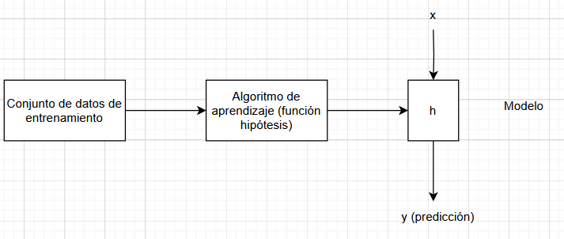
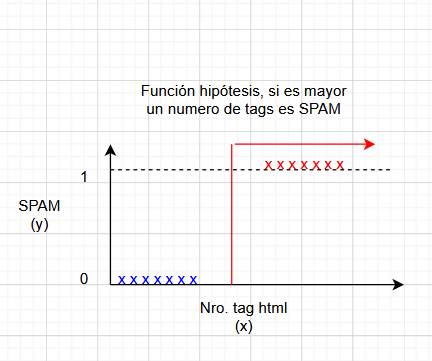
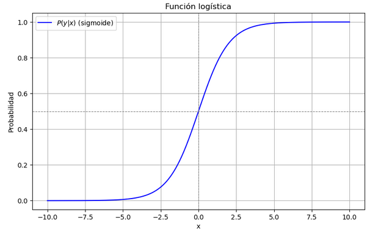
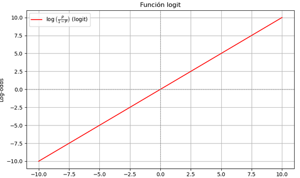

## Aprendizaje Supervisado - Regresion Logistica - Clasificación

El aprendizaje supervisado consiste en encontrar una función ℎ (hipótesis) que aproxime la función real 𝑓(𝑥) a partir de un conjunto de entrenamiento con pares de entrada-salida. Esta hipótesis se elige dentro de un espacio de hipótesis 𝐻, que puede incluir funciones lineales, polinomiales, lógicas, entre otras.

<p align="center">

</p>

La función resultante es utilizada posteriormente para predecir valores a partir de ejemplos de datos no etiquetados.

### Selección de conjunto de datos

El conjunto de datos son pares de datos etiquetados, en este caso un analista indicará en función a la experiencia el etiquetado de datos.

P.e. en el caso conjunto de datos para la detección de correos Spam, el conjunto de datos sería de la siguiente forma.

|email(x) |etiqueta(y)|
|---------|-----------|
|email1   |1          |
|email2   |0          |
|email3   |1          |
|...      |...        |

donde:
x = variables de entrada
y = variables de salida
(x,y) =  ejemplo de entrenamiento

0 : Clase Negativa (Correo legitimo)
1 : Clase Positiva (Correo Spam)


### Representacion
- Se puede basar en conocimiento previo o en un análisis exploratorio de datos (gráficos, pruebas estadísticas).
- Se pueden probar diferentes espacios y evaluar cuál se ajusta mejor.


<p align="center">

</p>


Ejemplo:

Supón que tienes este modelo:

$$P(y=1∣x) = \frac{1}{1 + e^{(−3+1.5x)}}$$

Ejemplo:
Si x es el numero de de tag html

    Si x=0, entonces:
    z=−3+1.5(0)=−3⇒probabilidad≈0.047(muybaja)
    z=−3+1.5(0)=−3⇒probabilidad≈0.047(muybaja)

    Si x=2, entonces:
    z=−3+1.5(2)=0⇒probabilidad=0.5
    z=−3+1.5(2)=0⇒probabilidad=0.5

    Si x=4, entonces:
    z=−3+1.5(4)=3⇒probabilidad≈0.95
    z=−3+1.5(4)=3⇒probabilidad≈0.95

## Función de hipótesis

La función logit fue introducida por Joseph Berkson en el año 1944. Él era un bioestadístico que trabajaba en la Clínica Mayo en EE. UU. Berkson usó la función logit como alternativa a otro método de análisis para variables binarias, en especial en contextos médicos.

Propuso el uso de la función:

$$
logit(p) = log\left(\frac{p}{1 - p}\right)
$$

como una forma de transformar probabilidades para que pudieran analizarse con modelos lineales.

Berkson se basó en el concepto de odds (probabilidades relativas), que ya se usaban en estadística médica. El trabajo previo sobre la función sigmoide o curva logística, que Pierre François Verhulst había usado en 1838 para modelar crecimiento poblacional. Técnicas estadísticas como la máxima verosimilitud, que comenzaron a desarrollarse con fuerza en los años 1930-40.

__Origen de la función logística__

La función logística proviene del campo de la biología poblacional en el siglo XIX. Fue introducida por Pierre François Verhulst en 1838 como una forma de modelar el crecimiento de poblaciones.

🔹 Problema original
Verhulst notó que las poblaciones:
- Crecen rápido al inicio (crecimiento exponencial).
- Pero luego se ralentizan por recursos limitados (comida, espacio).
- Finalmente, se estabilizan en un límite máximo (llamado "capacidad de carga").

Este comportamiento se modela con la ecuación logística diferencial:

$$
\frac{dP}{dt} = rP\left(1 - \frac{P}{K} \right)
$$

- 𝑃: población.
- 𝑟: tasa de crecimiento.
- 𝐾: capacidad máxima.

La solución de esa ecuación es la función logística:

$$
P(t) = \frac{K}{1 + Ae^{-rt}}
$$

- 𝑃(𝑡): población en el tiempo 𝑡.
- 𝐾: capacidad máxima del entorno (o población límite).
- 𝐴: constante relacionada con la condición inicial.
- 𝑟: tasa de crecimiento.
- $e^{-rt}$  : decaimiento exponencial.


Aunque Berkson introdujo el nombre “logit”, la regresión logística como modelo general se fue desarrollando en paralelo por otros estadísticos en los años siguientes. Se consolidó en los años 1960 y 70 como herramienta clave en epidemiología, ciencias sociales y aprendizaje automático.

Relación con Bernoulli
El modelo logit parte de la distribución Bernoulli, que describe experimentos con dos posibles resultados: éxito (1) o fracaso (0).

Al aplicar máxima verosimilitud sobre datos binarios, se obtiene una función que lleva directamente a la forma de la regresión logística, en donde el logit aparece naturalmente.

__En resumen__

Joseph Berkson (1944) acuñó el término logit y propuso usarlo para modelar probabilidades.
Se basó en:
- La función logística usada desde el siglo XIX (Verhulst).
- La necesidad de modelar relaciones no lineales entre variables y probabilidades.
- Los fundamentos de la estadística y la probabilidad (como Bernoulli).

__Explicacion__
Regresión logística
https://www.youtube.com/watch?v=82Hxn6hu_P4

1. Función logística (sigmoide):

$$
P(y|x) = \frac{e^{\theta_{0}+\theta_{1}x}}{1 + e^{\theta_{0}+\theta_{1}x}}
$$

Esto representa la probabilidad de que y=1y=1 dado xx. Es la salida de una regresión logística, y el resultado siempre está entre 0 y 1.

<p align="center">

</p>

2. Transformación logit (log-odds):

$$
ln \left(\frac{P(y|x)}{1 - P(y|x)}\right)=\theta_{0}+\theta_{1}x
$$

Esto es simplemente aplicar la función logit a la probabilidad P(y∣x). Convierte la probabilidad en "log-odds" (logaritmo de las razones de probabilidades), que puede tomar cualquier valor real.

3. Definición de logit:

$$
logit(p) = log\left(\frac{p}{1 - p}\right)
$$

<p align="center">

</p>


En tu caso, estás usando p=P(y∣x), así que:

$$
logit(P(y|x)) = \theta_{0}+\theta_{1}x
$$


Conexión clave

Lo que hace la regresión logística es modelar los log-odds como una función lineal de las variables independientes xx. Luego, al aplicar la función logística inversa (la sigmoide), se convierte ese valor en una probabilidad entre 0 y 1.


Ejemplo:
```
# Importar librerías necesarias
import numpy as np
import matplotlib.pyplot as plt
```

```
# Función sigmoide
def sigmoid(x, theta_0, theta_1):
    return 1 / (1 + np.exp(-(theta_0 + theta_1 * x)))
```
```
# Función para graficar sigmoide y logit
def plot_logit_and_sigmoid(theta_0=0.0, theta_1=1.0):
    x = np.linspace(-10, 10, 500)
    logit = theta_0 + theta_1 * x
    prob = sigmoid(x, theta_0, theta_1)

    fig, ax = plt.subplots(2, 1, figsize=(8, 10))

    # Gráfico de la sigmoide
    ax[0].plot(x, prob, label='Sigmoide', color='blue')
    ax[0].set_title('Función logística (sigmoide)')
    ax[0].set_xlabel('x')
    ax[0].set_ylabel('Probabilidad')
    ax[0].grid(True)
    ax[0].legend()
    ax[0].axhline(0.5, color='gray', linestyle='--', linewidth=0.8)
    ax[0].axvline(0, color='gray', linestyle='--', linewidth=0.8)

    # Gráfico del logit
    ax[1].plot(x, logit, label='Logit (log-odds)', color='red')
    ax[1].set_title('Función logit')
    ax[1].set_xlabel('x')
    ax[1].set_ylabel('Log-odds')
    ax[1].grid(True)
    ax[1].legend()
    ax[1].axhline(0, color='gray', linestyle='--', linewidth=0.8)
    ax[1].axvline(0, color='gray', linestyle='--', linewidth=0.8)

    plt.tight_layout()
    plt.show()
```
```
plot_logit_and_sigmoid(theta_0=1, theta_1=1)
```

Refencias

- The elemens of Statistical Learning 

https://drive.google.com/file/d/1VWYHo30-lzof_kDVHdxJ8tMMmYsBY3vY/view?usp=drive_link

- An Intoduction to Statical Leaning

https://drive.google.com/file/d/1nU9HisQVA1A16u0j4mGu9RWJ80-RCITR/view?usp=drive_link

- Metodos Predictivos de Aprendizaje Estadistico

https://rubenfcasal.github.io/aprendizaje_estadistico/m%C3%A9todos-de-aprendizaje-estad%C3%ADstico.html