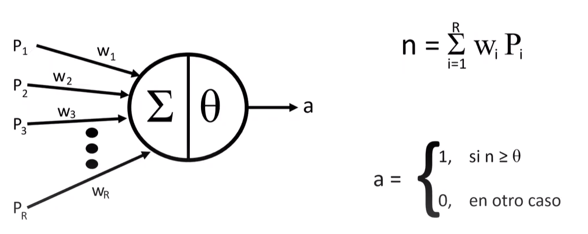
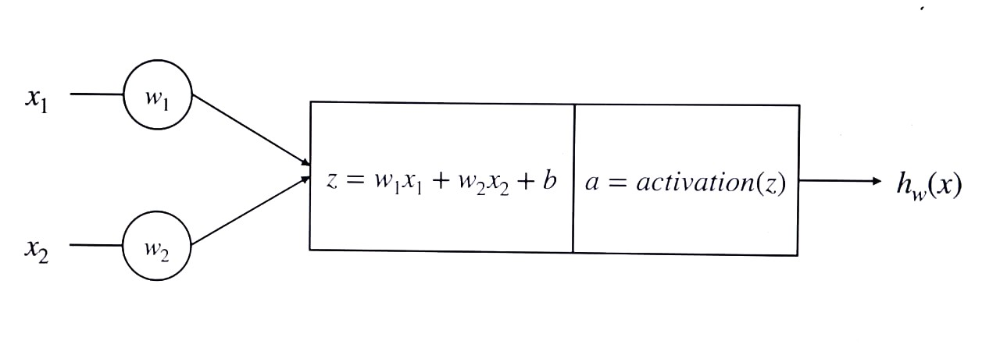

## Neurona de McCulloch y Pitts (Neurona M-P)

- Se corresponde con la primera neurona artificial de la historia. Propuesto en 1943.
- Se caracteriza porque recibe uno o más valores binarios {1,0} y retorna otro valor binario {1,0}
- Activa su salida cuando más de un número determinado de valores de entrada se encuentran activos
- Debe establecerse manualmente el número de valores de entrada que deben estar activos, a este valor se le denomina threshold

<p align="center">

</p>

Explicacion del modelo  de McCulloch y Pitts
https://www.youtube.com/watch?v=JaLMcVO1CCE

Ejemplo simple


```
#importar libreria
import numpy as np
```

```
# implemente la función del modelo M-P sin usar funciones predefinidas de numpy

def neuronaM-P(E,I,u):
    for ini in I:
        if ini == 1:
            return 0
    
    integracion = 0
    for ex in E:
        integracion = integracion + ex

    if integracion >= u:
        return 1
    else:
        return 0
```

```
# parametros
E=[1]
I=[0]
u=1

# Ejecución del modelo
print(neuronaM-P(E,I,u))
```

https://www.youtube.com/watch?v=SU-44XQPh9w


## Perceptron

- Propuesto por Frank Rosenblatt en 1958
- En 1969 fue refinado y analizado en detalle por Marvin Minsky y Seymour Papert
- Mejora el planteamiento de la neurona de McCulloch y Pitts añadiendo el concepto de "peso" numérico a las entradas y planeando un mecanismo para ajustarlos
- No recibe únicamente valores de entrada binarios, permite valores de entrada reales
- Se basa en un tipo de neurona artificial conocida como Threhold Logic Unit (TLU)
- La TLU computa una suma parametrizada de las entradas

### Threshold Logic Unit - TLU

- La TLU computa una suma parametrizada de las entradas
- Después, aplica una función de activación sobre la suma calculada anteriormente

<p align="center">

</p>

- El perceptrón se corresponde con una arquitectura copuesta por una única capa de tlUs
- Permite la clasificación de instancias en diferentes clases binarias de manera simultánea

### Funciones de activación

- El perceptrón permite la clasificación de instancias en clases binarias de manera simultánea
- Existen múltiples funciones de activación. Algunas de las más comunes son:


- Heaviside step function

```
        heaviside(z) = { 0 if z < 0
                         1 if z >= 0

```
- Sign function

```
                    -1 if z < 0
        sgn (z) = {  0 if z = 0
                     1 if z > 0
```


