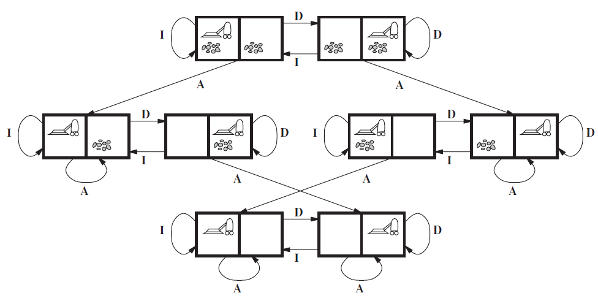
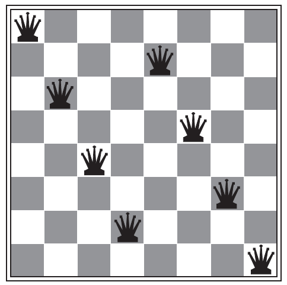

# Agentes Inteligentes

## Agentes y su entorno

Un agente es cualquier entidad capaz de percibir su entorno mediante sensores y actuar en él mediante actuadores. Los agentes pueden ser humanos (con ojos, oídos, manos, etc.) o robots (que reciben información de archivos, teclado o red y responden con mensajes, archivos o paquetes).

El comportamiento de un agente se describe mediante su función de agente, que asigna una acción a cada secuencia de percepciones. Esta función puede representarse en una tabla, aunque generalmente es demasiado grande. Para agentes artificiales, esta función se implementa mediante un programa del agente en una arquitectura específica.

Como ejemplo, el mundo de la aspiradora tiene dos cuadrículas (A y B), donde la aspiradora percibe su ubicación y si hay suciedad. Un agente simple sigue la regla: si hay suciedad, aspirar; de lo contrario, moverse.

Finalmente, la noción de agente es una herramienta analítica más que una clasificación absoluta, ya que, en teoría, incluso una calculadora podría considerarse un agente..

## Comportamiento correcto: el concepto de racionalidad

Un agente racional es aquel que toma decisiones que maximizan su éxito según una medida de rendimiento definida por su diseñador. Su racionalidad depende de cuatro factores, cada uno con ejemplos:

- La medida de rendimiento (cómo se evalúa el éxito).

    Ejemplo: En el caso de una aspiradora autónoma, la medida de rendimiento podría ser la cantidad de suciedad eliminada en un periodo de tiempo. Si la métrica fuera solo "movimiento constante", la aspiradora podría moverse sin limpiar, lo que no sería realmente útil.

- Su conocimiento del entorno (qué sabe sobre su mundo).

    Ejemplo: Un coche autónomo que conoce el mapa de la ciudad puede anticipar rutas eficientes. Sin embargo, si no sabe que hay una calle cerrada, podría intentar tomar un camino bloqueado.

- Las acciones disponibles (qué puede hacer el agente).

    Ejemplo: Un dron de entrega puede solo avanzar, girar y aterrizar. Si necesita evitar un obstáculo y no puede retroceder, su falta de opciones podría llevarlo a quedarse atascado.

- La secuencia de percepciones recibidas (qué ha experimentado hasta ahora).

    Ejemplo: Un asistente de voz aprende de las palabras que ha escuchado. Si una persona habla en otro idioma y el asistente nunca ha recibido palabras en ese idioma, no podrá responder correctamente.

Un agente no necesita ser perfecto, sino actuar de manera que maximice el rendimiento esperado con la información disponible. No es lo mismo racionalidad que omnisciencia. Además, un agente debe ser autónomo y aprender de su experiencia para mejorar su desempeño con el tiempo. 

Ejemplo de la avispa cavadora:
La avispa cavadora tiene un comportamiento programado. Cuando captura una oruga para alimentar a sus crías, sigue un procedimiento fijo:

- Cava una madriguera.
- Trae la oruga y la deja en la entrada.
- Entra a revisar que todo esté bien.
- Si todo está bien, arrastra la oruga adentro.

Si alguien mueve la oruga unos centímetros mientras la avispa está dentro revisando, al salir repetirá el proceso desde el paso 2 en lugar de adaptarse. Este comportamiento muestra falta de aprendizaje y autonomía, ya que la avispa sigue el mismo procedimiento sin cuestionarlo.

## Construcción de Agentes Racionales y Entornos de Trabajo
Para diseñar agentes racionales, primero es necesario comprender los entornos en los que operan. Estos entornos representan los "problemas" que los agentes buscan resolver. Para ello, se define un marco de especificación conocido como REAS (Rendimiento, Entorno, Actuadores y Sensores).

### Especificación del Entorno de Trabajo
El entorno de trabajo de un agente debe definirse de manera clara para diseñarlo de forma efectiva. Un ejemplo introductorio es el agente aspiradora, donde se establecen los elementos clave de su entorno, como la presencia de suciedad y los movimientos del agente.

Un ejemplo más complejo es el de un taxista automatizado, cuyo entorno incluye múltiples variables:

| Tipo de agente | Medidas de rendimiento | Entorno       | Actuadores   | Sensores                     |
|----------------|------------------------|---------------|--------------|------------------------------|
|Taxista         | Seguro, rápido,legal,  | Carreteras,   | Dirección,   | Cámaras, sónar, velocímetro, |
|                | viaje confortable,     | otro tráfico, | acelerador,  | GPS, tacómetro, visualizador |
|                | maximización           | peatones,     | freno, señal,| de la aceleración, sensores  |
|                | del beneficio          | clientes      | bocina,      | del motor, teclado           |
|                |                        |               | visualizador |                              |

Este análisis muestra cómo la complejidad del entorno afecta el diseño del agente.

### Propiedades de los Entornos de Trabajo
Los entornos de trabajo pueden clasificarse según diversas dimensiones, lo que influye en el diseño de los agentes.

a) Totalmente observable vs. _Parcialmente observable_
- Un entorno es totalmente observable si el agente puede acceder a toda la información relevante en cada momento.
- Es parcialmente observable si existen factores desconocidos o sensores limitados (por ejemplo, un taxi no puede saber qué piensan otros conductores).

b) Determinista vs. _Estocástico_
- Un entorno es determinista si su estado futuro depende completamente del estado actual y de las acciones del agente.
- Es estocástico si existen elementos impredecibles (ej., el tráfico para un taxi).

c) Episódico vs. _Secuencial_
- Un entorno episódico implica que cada acción del agente es independiente de las anteriores (ej., un sistema de inspección en una fábrica).
- Un entorno secuencial requiere considerar acciones pasadas, ya que afectan el futuro (ej., un taxista tomando decisiones de ruta).

d) Estático vs. _Dinámico_
- Un entorno estático no cambia mientras el agente toma decisiones (ej., un crucigrama).
- Un entorno dinámico cambia constantemente y requiere que el agente se adapte en tiempo real (ej., el tráfico).

e) Discreto vs. _Continuo_
- Un entorno es discreto si tiene un número finito de estados y acciones (ej., ajedrez).
- Es continuo si sus estados y acciones varían sin límites definidos (ej., la conducción de un automóvil).

f) Agente individual vs. _Multiagente_
- Un entorno de agente individual implica que el agente interactúa solo con el medio (ej., un sistema de diagnóstico médico).
- Un entorno multiagente implica la interacción con otros agentes, que pueden ser competitivos (ajedrez) o cooperativos (evitar colisiones en tráfico).

### Complejidad y Simulación de Entornos
En la práctica, la mayoría de los entornos reales combinan múltiples dimensiones de complejidad, como ocurre con el taxi automatizado (parcialmente observable, estocástico, secuencial, dinámico, continuo y multiagente).

Para evaluar el desempeño de los agentes en diferentes entornos, se utilizan simuladores, los cuales pueden generar variaciones en las condiciones para probar su adaptabilidad.

En Conclusión, el diseño de un agente racional requiere una comprensión detallada de su entorno de trabajo. La clasificación de los entornos según sus propiedades ayuda a determinar qué estrategias y técnicas deben emplearse en la construcción del agente. Entornos más complejos requieren agentes más sofisticados, lo que influye directamente en la implementación de la inteligencia artificial.

## Ejercicios

1. Descargar el siguiente archivo [DESCARGAR](/Agentes_Inteligentes/Actividad%20sobre%20Agentes.xlsx))
2. Lea los siguientes ejercicios:

a) Aspiradora de 1x2;
Este problema de juguete tiene localizaciones discretas, suciedad discreta, limpieza fiable, y nunca se ensucia una vez que se ha limpiado. . Una cosa a tener en cuenta es que el estado está determinado por la localización del agente y por las localizaciones de la suciedad.
Un entorno grande con n localizaciones tiene n por 2 a la n estados.

b) 8-puzle;
El 8-puzle pertenece a la familia de puzles con piezas deslizantes, los cuales a menudo se usan como problemas test para los nuevos algoritmos de IA. Esta clase general se conoce por ser NP completa, así que no esperamos encontrar métodos perceptiblemente mejores (en el caso peor) que los algoritmos de búsqueda descritos en este capítulo y en el siguiente. El 8-puzle tiene 9! / 2 = 181,440 estados alcanzables y se
resuelve fácilmente. El 15 puzle (sobre un tablero de 4 x 4) tiene alrededor de 1,3 trillones de estados, y configuraciones aleatorias pueden resolverse óptimamente en pocos milisegundos por los mejores algoritmos de búsqueda. El 24 puzle (sobre un tablero de 5 x 5) tiene alrededor de 1025 estados, y configuraciones aleatorias siguen siendo absolutamente difíciles de resolver de manera óptima con los computadores y algoritmos actuales.

c) 8-reinas;

El objetivo del problema de las 8-reinas es colocar las ocho reinas en un tablero de ajedrez de manera que cada reina no ataque a ninguna otra. (Una reina ataca alguna pieza si está en la misma fila, columna o diagonal.) La Figura muestra una configuración que no es solución: la reina en la columna de más a la derecha está atacando a la reina de arriba a la izquierda.

d) Juego de Wumpus (https://www.youtube.com/watch?v=1Aa5IhdnPwU)
Acceder al Juego Online (https://thiagodnf.github.io/wumpus-world-simulator/)

e) Cubo de Rubik

3. Complete el archivo de la Columna B hasta la F (Identifique la descripción REAS que define el entorno de trabajo para los ejercicios revisados en el punto 2).

4. Complete el archivo de la Columna G hasta la L (Indique las Propiedades de Entorno para los ejercicios revisados en el punto 2)
