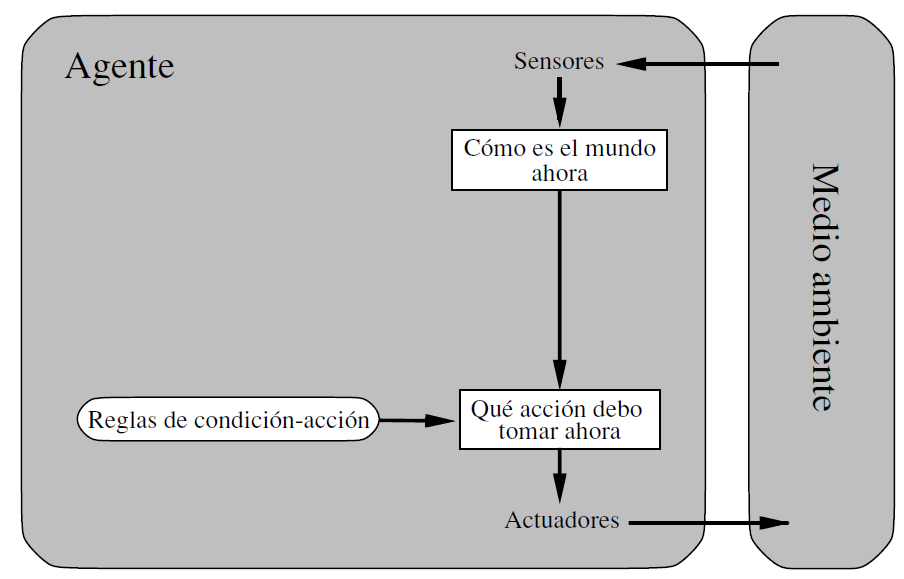
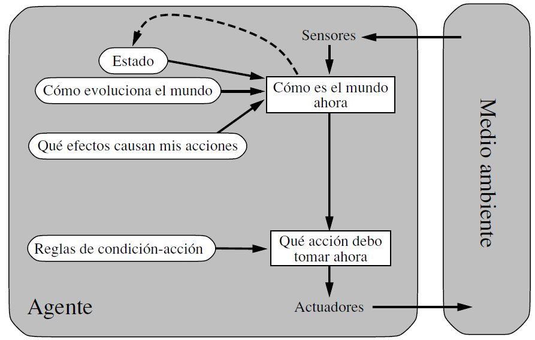
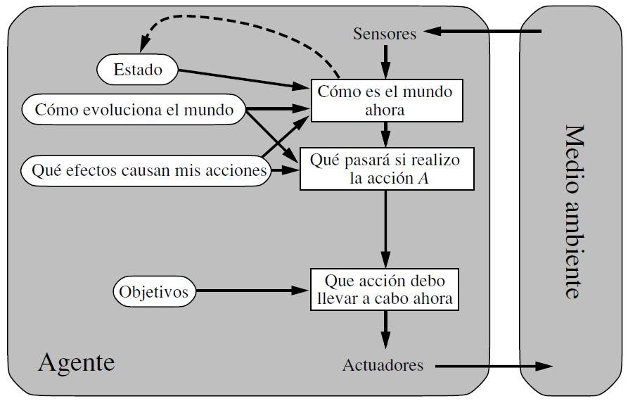
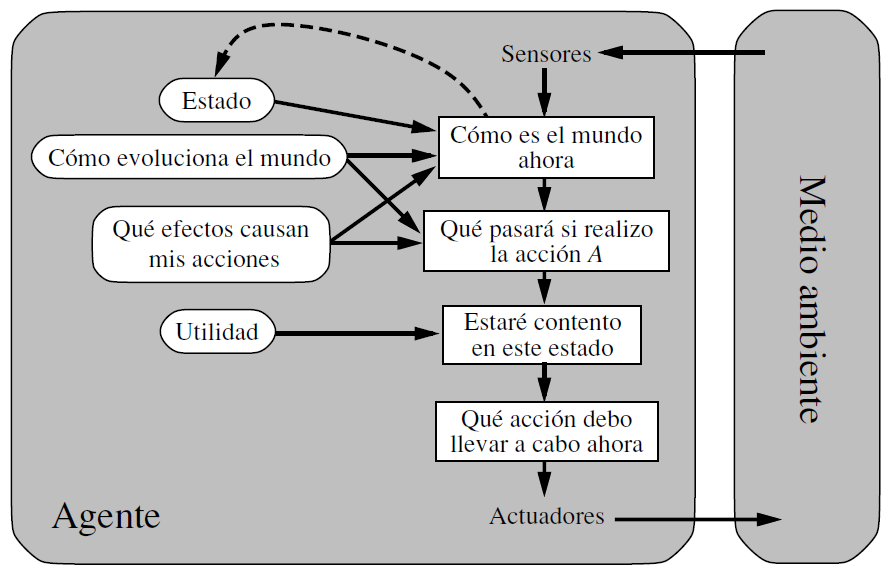
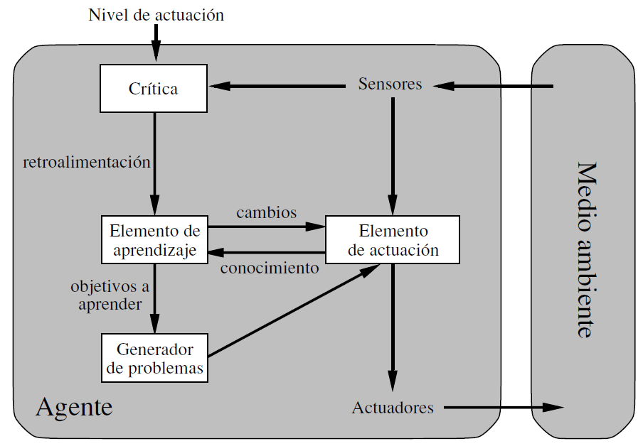
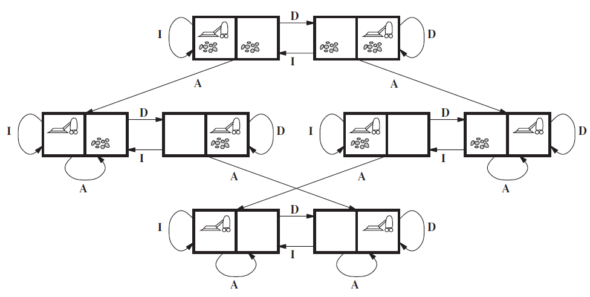
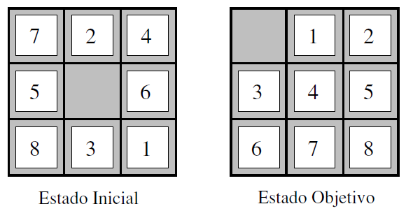
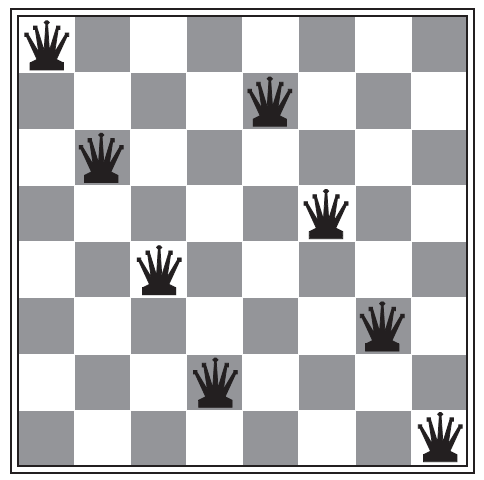

## Tipos de Agentes en Inteligencia Artificial
### 1. Agentes Reactivos Simples
- Definición: Responden a las percepciones actuales sin considerar el historial.
- Ejemplo: Una aspiradora automática que decide limpiar solo si detecta suciedad.
- Funcionamiento: Se basa en reglas de condición-acción, como "si el coche de adelante frena, entonces frenar".
- Limitaciones:

    - No funcionan bien en entornos parcialmente observables.
    - Pueden caer en bucles infinitos.
    - La aleatoriedad puede mejorar su desempeño en ciertos casos, pero sigue siendo un enfoque limitado.

### 2. Agentes Reactivos Basados en Modelos
- Definición: Incorporan un estado interno para representar información sobre partes del mundo que no pueden ver directamente.
- Ejemplo: Un coche autónomo que recuerda la posición de otros vehículos aunque no los tenga a la vista.
- Funcionamiento:
    - Utilizan un modelo del mundo que representa cómo evolucionan los objetos y cómo afectan las acciones del agente.
    - Se combinan percepciones actuales con el estado interno para tomar decisiones más informadas.

### 3. Agentes Basados en Objetivos
- Definición: Además de percibir el mundo, tienen metas que guían sus decisiones.
- Ejemplo: Un taxi autónomo que decide si girar o seguir recto en función del destino del pasajero.
- Funcionamiento:
    - Evalúan diferentes acciones y sus consecuencias en función de los objetivos.
    - Requieren técnicas como búsqueda y planificación para encontrar secuencias de acciones óptimas.

- Ventajas:
    - Más flexibles que los agentes reactivos.
    - Permiten adaptaciones dinámicas (ej. ajustar el comportamiento según el clima).

### 4. Agentes Basados en Utilidad
- Definición: No solo buscan alcanzar metas, sino que optimizan la calidad de sus decisiones mediante una función de utilidad.
- Ejemplo: Un taxi que elige la ruta más rápida y segura en lugar de solo llegar al destino.
- Funcionamiento:
    - Usan una función de utilidad para cuantificar el valor de diferentes estados posibles.
    - Permiten tomar decisiones racionales al equilibrar diferentes factores (ej. rapidez vs. seguridad).

- Ventajas:
    - Pueden manejar situaciones con objetivos en conflicto.
    - Permiten decisiones óptimas incluso en entornos inciertos.

### 5. Agentes que Aprenden
- Definición: Son capaces de mejorar su desempeño a lo largo del tiempo mediante el aprendizaje.
- Ejemplo: Un programa de ajedrez que aprende de sus errores y mejora sus estrategias.
- Componentes:
    - Elemento de actuación: Ejecuta acciones basadas en percepciones.
    - Elemento de aprendizaje: Ajusta el comportamiento del agente para mejorar su desempeño.
    - Crítica: Evalúa el desempeño del agente y proporciona retroalimentación.
    - Generador de problemas: Explora nuevas estrategias para mejorar el aprendizaje.

Ventajas:
    - Pueden adaptarse a entornos desconocidos.
    - Mejoran con la experiencia, evitando la necesidad de programar todas las reglas manualmente.

## Ejercicios

1. Identifique la descripción REAS que define el entorno de trabajo para cada uno de
los siguientes agentes:

a) Aspiradora de 1x2;
Este problema de juguete tiene localizaciones discretas, suciedad discreta, limpieza fiable, y nunca se ensucia una vez que se ha limpiado. . Una cosa a tener en cuenta es que el estado está determinado por la localización del agente y por las localizaciones de la suciedad.
Un entorno grande con n localizaciones tiene n por 2 a la n estados.

b) 8-puzle;
El 8-puzle pertenece a la familia de puzles con piezas deslizantes, los cuales a menudo se usan como problemas test para los nuevos algoritmos de IA. Esta clase general se conoce por ser NP completa, así que no esperamos encontrar métodos perceptiblemente mejores (en el caso peor) que los algoritmos de búsqueda descritos en este capítulo y en el siguiente. El 8-puzle tiene 9! / 2 = 181,440 estados alcanzables y se
resuelve fácilmente. El 15 puzle (sobre un tablero de 4 x 4) tiene alrededor de 1,3 trillones de estados, y configuraciones aleatorias pueden resolverse óptimamente en pocos milisegundos por los mejores algoritmos de búsqueda. El 24 puzle (sobre un tablero de 5 x 5) tiene alrededor de 1025 estados, y configuraciones aleatorias siguen siendo absolutamente difíciles de resolver de manera óptima con los computadores y algoritmos actuales.

c) 8-reinas;

El objetivo del problema de las 8-reinas es colocar las ocho reinas en un tablero de ajedrez de manera que cada reina no ataque a ninguna otra. (Una reina ataca alguna pieza si está en la misma fila, columna o diagonal.) La Figura muestra una configuración que no es solución: la reina en la columna de más a la derecha está atacando a la reina de arriba a la izquierda.

d) Juego de Wumpus (https://www.youtube.com/watch?v=1Aa5IhdnPwU)
Acceder al Juego Online (https://thiagodnf.github.io/wumpus-world-simulator/)

e) Cubo de Rubik

2. Indique las Propiedades de Entorno (p.e. (parcialmente observable, estocástico, secuencial, dinámico, continuo y multiagente)) de los agentes anteriores

3. Seleccione el diseño de agente adecuado y explique cada uno de los componentes internos del agente.

