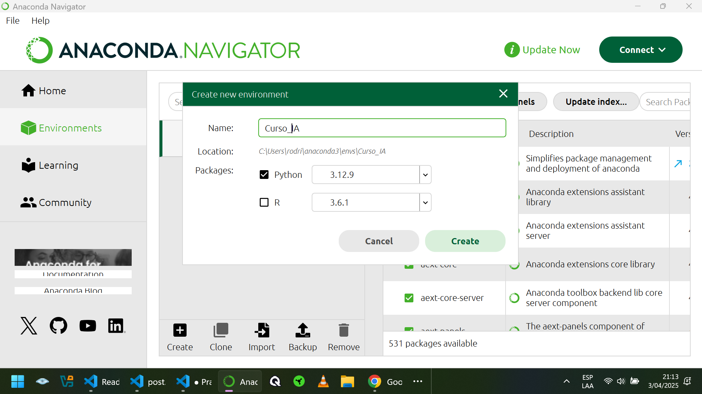
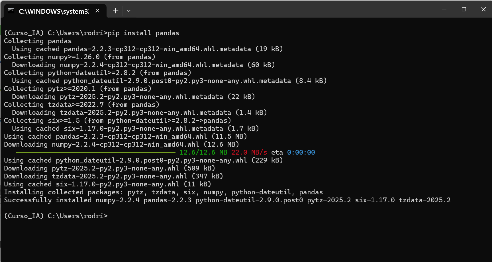
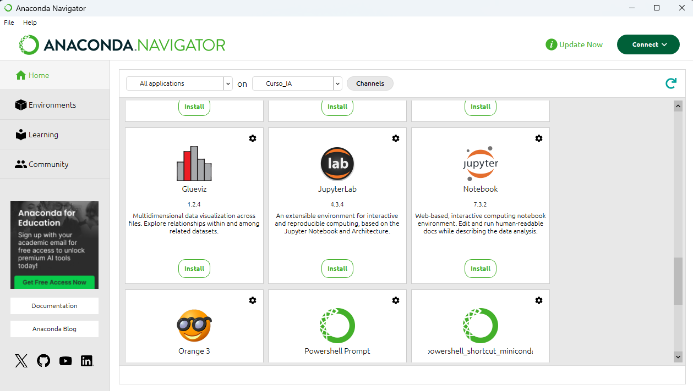

# Laboratorios Práctico

## Instalación de Anaconda

https://www.anaconda.com/blog/anaconda-individual-edition-2021-11 

https://www.anaconda.com/download/success

## Creación de un ambiente

Lo llamaremos Curso_IA

<p align="center">

</p>

## Instalar Libreria Pandas

Apretamos el boton circular verde y hacemos click en Abrir Terminal (Open Terminal) y probamos ejecutar la instalación de la libreria de panda.

```
 pip install pandas
```

<p align="center">

</p>

## Instalar Jupiter

Seleccionamos HOME y buscamos Jupiter.

<p align="center">

</p>
